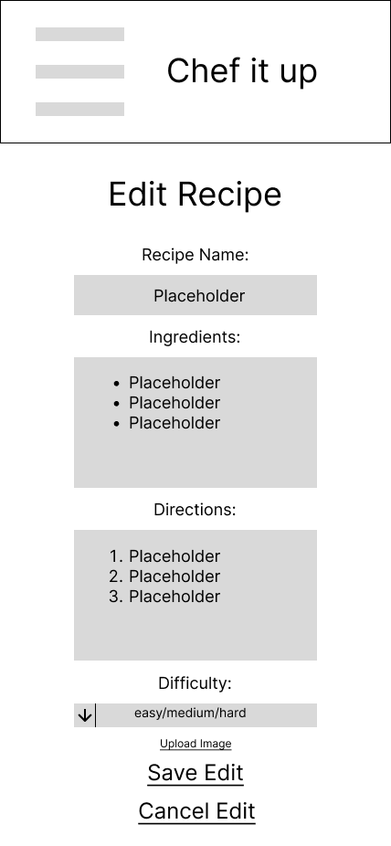

# User Experience Design

## prototype
[Chef-it-up prototype](https://www.figma.com/proto/XmfA8KYnzXZjrwmipKHRqC/chef-wireFrame?type=design&node-id=21-189&t=FCktxtUEJPwEFp8F-1&scaling=scale-down&page-id=0%3A1&starting-point-node-id=12%3A13&mode=design)

## Wireframe Diagrams

### Hamburger Menu

Hamburger menu that should appear when the resulting hamburger icon is pressed on the screens. 

### Login 

Login screen tha talso has option to naviagte to register if user does not have an account yet.

### Register 

Register Screen where users can register an account.

### About us 

Page containing info about what our application is and contact info 

### Browse Recipe Page

Browse all recipes made by other users. 

### Individual Recipe Info

Info about an individual recipe from the browse recipe page. Users can click on the favorite button to add it to their favorite recieps list.

### Favorite Recipe 

Page containing all a users favorite Recipe each of these recipe cards are clickable.

### Favorite Individual Recipe Info 

Info about your one of your favorited recipes. Users can click on the unfavorite button to unfavorite the recipe. 

### My Recipe 

Browse all recipes made by user. There are also button to naviagte to creating and genreating a recipe. 

### My individual Recipe Info 

Info about an individual recipe from the my recipe page. Users can edit and delete this recipe. 

### Edit Recipe 

Edit one of the recipes you created
 

### Add a Recipe 

Add a recipe 

### Generate a Recipe 

Generate a Recipe 

### Generate a Recipe Results 

Result of generating a recipe 

### My Fridge 

Page that has all ingredients in your fridge 

### Ingredient Info 

Info about an individual ingredient 

### Edit Ingredient 

Edit info about an ingredient

### Add Ingredient

Add an Ingredient to your fridge

### User Profile 

Your User profile 

### Edit User Profile 

Edit User Profile
